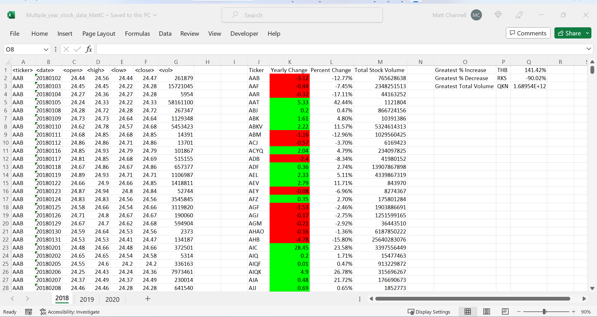
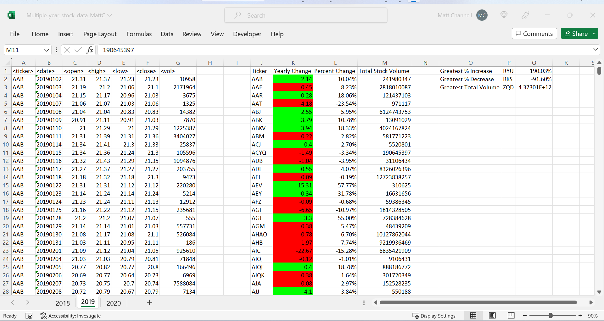
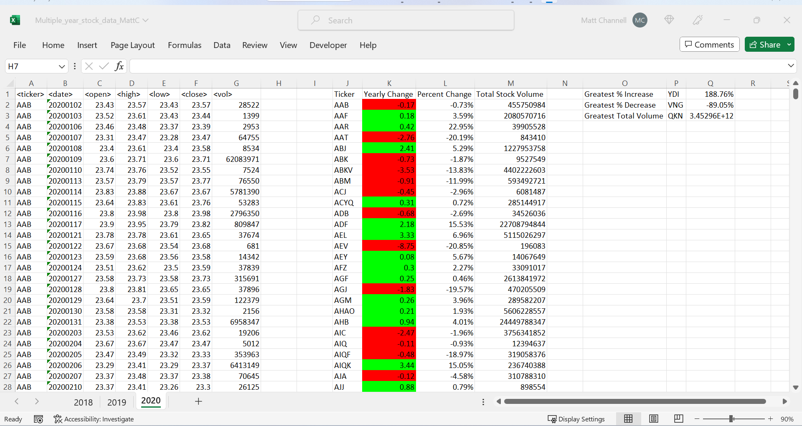

# VBA-challenge

In this project, I used Excel and VBA to analyize the overal change in thousands of stock from  2018 to 2020. 

# About the Code
Summary of the Data for each year is as follows, with VBA script used to come up with these summaries found in the Module2Assignment.bas file

2018

2019

2020

